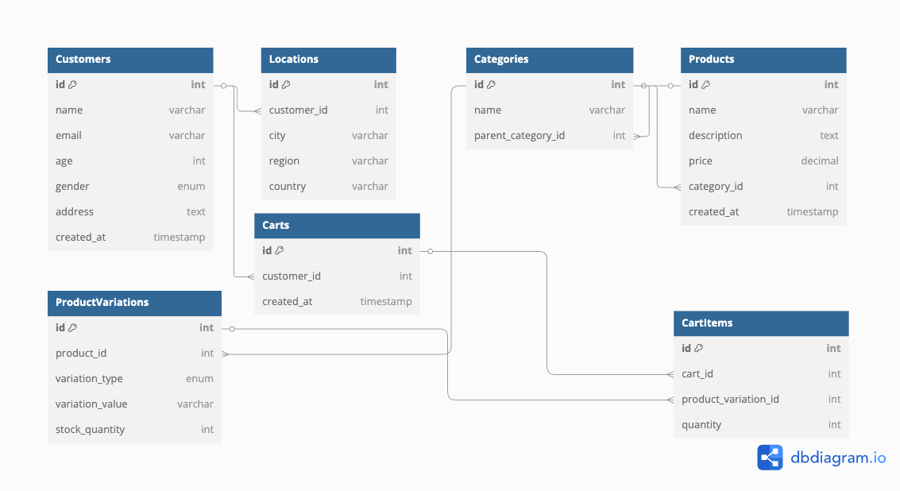

# Store Owner Database

**Table of Contents**

[TOC]

## Requirements
- As a store owner, I'd like to save customer information, so I can track age, gender and location for analysis purpose.
- As a store owner, I'd like to have a list of products, so my customers can browse and discover my collections.
- Each product can be listed in categories.
- Each product has different and multiple variation which can be color, size or anything.
- As a store owner, I would like my customers to be able to add items to cart, so they can process to check out.

## Database

### Customer Table
```sql
-- Customers Table
CREATE TABLE Customers (
    id INT PRIMARY KEY AUTO_INCREMENT,
    name VARCHAR(100) NOT NULL,
    email VARCHAR(100) UNIQUE NOT NULL,
    age INT,
    gender ENUM('male', 'female', 'other'),
    address TEXT,
    created_at TIMESTAMP DEFAULT CURRENT_TIMESTAMP,
    INDEX idx_customers_gender (gender), -- Index for gender
    INDEX idx_customers_age (age), -- Index for age
    INDEX idx_customers_created_at (created_at) -- Index for filtering by created_at (useful if we want to look for customers created after a certain time etc)

);

```

### Locations Table (optional)
Put **optional** as this can help with indexing and searching for locations.
```sql
-- Locations Table
CREATE TABLE Locations (
    id INT PRIMARY KEY AUTO_INCREMENT,
    customer_id INT NOT NULL,
    city VARCHAR(255),
    region VARCHAR(255),
    country VARCHAR(255),
    FOREIGN KEY (customer_id) REFERENCES Customers(id),
    INDEX idx_locations_city (city), -- Index for city
    INDEX idx_locations_region (region), -- Index for region
    INDEX idx_locations_country (country) -- Index for country
);

```

### Categories Table
```sql
-- Categories Table
CREATE TABLE Categories (
    id INT PRIMARY KEY AUTO_INCREMENT,
    name VARCHAR(255) NOT NULL,
    parent_category_id INT, -- For hierarchical categories
    FOREIGN KEY (parent_category_id) REFERENCES Categories(id),
    INDEX idx_categories_name (name) -- Index for category name
);

```

### Products Table
```sql
CREATE TABLE Products (
    id INT PRIMARY KEY AUTO_INCREMENT,
    name VARCHAR(255) NOT NULL,
    description TEXT,
    price DECIMAL(10, 2) NOT NULL,
    category_id INT NOT NULL, -- Links to Categories table
    created_at TIMESTAMP DEFAULT CURRENT_TIMESTAMP,
    FOREIGN KEY (category_id) REFERENCES Categories(id),,
    INDEX idx_products_name (name), -- Index for product name
    INDEX idx_products_category (category_id), -- Index for category lookup
    INDEX idx_products_price (price), -- Index for filtering products by price
    INDEX idx_products_created_at (created_at) -- Index for sorting by created_at
);

```

### Product Variations Table
```sql
CREATE TABLE ProductVariations (
    id INT PRIMARY KEY AUTO_INCREMENT,
    product_id INT NOT NULL,
    variation_type ENUM('color', 'size', 'other') NOT NULL,
    variation_value VARCHAR(50) NOT NULL,
    stock_quantity INT,
    FOREIGN KEY (product_id) REFERENCES Products(id),
    INDEX idx_product_variations_product (product_id), -- Index for product lookup
    INDEX idx_product_variations_type (variation_type), -- Index for variation type
    INDEX idx_product_variations_value (variation_value) -- Index for variation value
);

```

### Carts Table
```sql
CREATE TABLE Carts (
    id INT PRIMARY KEY AUTO_INCREMENT,
    customer_id INT NOT NULL,
    created_at TIMESTAMP DEFAULT CURRENT_TIMESTAMP,
    FOREIGN KEY (customer_id) REFERENCES Customers(id),
    INDEX idx_carts_customer_id (customer_id), -- Index for customer lookup
    INDEX idx_carts_created_at (created_at) -- Index for filtering by creation date
);
```

### Cart Items Table
```sql
CREATE TABLE CartItems (
    id INT PRIMARY KEY AUTO_INCREMENT,
    cart_id INT NOT NULL,
    product_variation_id INT NOT NULL,
    quantity INT NOT NULL,
    FOREIGN KEY (cart_id) REFERENCES Carts(id),
    FOREIGN KEY (product_variation_id) REFERENCES ProductVariations(id),
    INDEX idx_cart_items_cart_id (cart_id), -- Index for cart lookup
    INDEX idx_cart_items_product_variation_id (product_variation_id) -- Index for product variation lookup
);
```


## Insert Queries
### Create customer and location
```sql
INSERT INTO Customers (name, email, age, gender, address) 
VALUES ('Jason Roberts', 'john.doe@example.com', 30, 'male', '231 Bangkok St');

INSERT INTO Locations (customer_id, city, region, country) 
VALUES (1, 'Khlong Toei', 'Bangkok', 'Thailand');

```

### Insert a Category (Example)
```sql
INSERT INTO Categories (name) 
VALUES ('Electronics');


```

### Insert a Product (Example)
```sql
INSERT INTO Products (name, description, price, category_id) 
VALUES ('Wireless Mouse', 'A wireless mouse with hi-tech design', 25.99, 1);

```

### Insert Product Variations (Example)
```sql
INSERT INTO ProductVariations (product_id, variation_type, variation_value, stock_quantity) 
VALUES (1, 'color', 'Black', 50), 
       (1, 'color', 'White', 30),
       (1, 'size', 'Medium', 20);

```

### Insert a Cart (Example)
```sql
INSERT INTO Carts (customer_id) 
VALUES (1);  -- Assuming customer with ID 1

```

### Insert Cart Items (Example)
```sql
INSERT INTO CartItems (cart_id, product_variation_id, quantity) 
VALUES (1, 1, 2),  -- Product Variation ID 1 (Black Wireless Mouse), 2 items
       (1, 2, 1);  -- Product Variation ID 2 (White Wireless Mouse), 1 item

```


## Fetch and Filter Queries

### Fetch customer's location (Example)
``` sql
SELECT c.name, c.email, c.age, c.gender, c.address, l.city, l.region, l.country
FROM Customers c
JOIN Locations l ON c.id = l.customer_id
WHERE c.id = 1; -- Replace 1 with the desired customer ID

```

### Filter Customers by Location)(Example)
``` sql
SELECT c.id, c.name, c.email, c.age, c.gender, l.city, l.region, l.country
FROM Customers c
JOIN Locations l ON c.id = l.customer_id
WHERE l.city = 'Bangkok';  -- Filters customers by city


```

### Other Customers Filters (Example)
``` sql
 --Filter by Gender
SELECT * FROM Customers WHERE gender = 'female';

 -- Filter by Age Range
SELECT * FROM Customers  WHERE age BETWEEN 28 AND 50;

```

### Fetch all products in a Category (Example)
``` sql
SELECT p.id, p.name, p.price
FROM Products p
WHERE p.category_id = 1; -- Replace 1 with the desired category ID

```

### Fetch all variations of a product (Example)
``` sql
SELECT pv.id, pv.variation_type, pv.variation_value, pv.stock_quantity
FROM ProductVariations pv
JOIN Products p ON pv.product_id = p.id
WHERE p.id = 1;  -- Replace 1 with the actual product ID


```

### Fetch Items in a Customer’s Cart (Example)
``` sql
SELECT 
    ci.id AS cart_item_id,
    p.name AS product_name,
    pv.variation_type,
    pv.variation_value,
    ci.quantity
FROM CartItems ci
JOIN Carts c ON ci.cart_id = c.id
JOIN ProductVariations pv ON ci.product_variation_id = pv.id
JOIN Products p ON pv.product_id = p.id
WHERE c.customer_id = 1;  -- Replace 1 with the actual customer ID

```
### Sum of the cart items (Example)
``` sql
SELECT SUM(ci.quantity * p.price) AS cart_total
FROM CartItems ci
JOIN Products p ON ci.product_id = p.id
WHERE ci.cart_id = [CART_ID];  -- Replace with the specific cart ID

```

## Database Schema Diagram




